# Gateway ECU System Architecture Design

## 1. System Overview
This document defines the architecture for a High-Performance Gateway ECU based on a J784S4-like SoC. The system is a Heterogeneous Computing platform designed to bridge external connectivity, high-bandwidth internal zones (Ethernet), and legacy real-time networks (CAN), while maintaining strict mixed-criticality isolation (QM, ASIL-B, ASIL-D).

## 2. Hardware Resource Allocation
The SoC resources are partitioned to ensure freedom from interference (FFI) and optimal performance for specific workloads.

| Cluster | Cores | Safety Level | OS / Runtime | Primary Function |
| :--- | :--- | :--- | :--- | :--- |
| **MPU Cluster** | 4x Cortex-A72 | QM / ASIL-B | **Type-1 Hypervisor** (e.g., QNX Hypervisor, Xen) <br> - **VM1**: Embedded Linux (QM) <br> - **VM2**: Safety RTOS (ASIL-B) | **VM1**: External Connectivity, Cloud Gateway, OTA <br> **VM2**: Adaptive AUTOSAR, Vehicle Control Logic |
| **MCU Cluster** | 6x Cortex-R5F | ASIL-D | **Classic AUTOSAR** | Real-time Signal Gateway, Safety Monitoring, Vehicle State Management |
| **Security/PM** | 2x Cortex-M4F | ASIL-D | Bare-metal / Safe RTOS | **Core 1 (SMS)**: Cryptomodule Firmware (PKI/HSM) <br> **Core 2**: Power Management & Boot |

## 3. Network Topology & Communication Paths
The architecture enforces strict separation of external and internal traffic.

- **Ethernet Interfaces**: Terminate physically at the A72 cluster.
    - **External Traffic**: Routed mainly to **VM1 (Linux)** for filtering, authentication, and reverse proxying (e.g. from Cloud/OBD).
    - **Internal Backbone**: High-speed traffic routed to **VM2 (Adaptive)** for control or **VM1** for data.
        - **Connected Nodes**: Telematics Control Unit (TCU) and Infotainment (IVI) are connected via Ethernet.
- **CAN Interfaces**: Terminate physically at the R5 cluster.
    - **Physical Layer**: Mixed network where **~40% of ECUs use CAN-FD** and 60% use Classical CAN.
    - **Real-time Control**: Direct access for low-latency signal processing by Classic AUTOSAR.
- **Inter-Core Communication (IPC)**:
    - **A72 <-> R5**: Shared Memory / VirtIO-based IPC (RPMsg). Used to bridge Ethernet service-oriented data to CAN signals (Signal-to-Service translation).
    - **VM1 <-> VM2**: Hypervisor-managed shared memory (virtio-net or similar) for strictly controlled data exchange.

## 4. Software Component & Application Layer

### A. Embedded Linux (VM1 - QM)
*The "Connected" Face of the vehicle.*
- **Reverse Proxy (`reverse-proxy`)**: (Nginx/Envoy) Terminates TLS from cloud/OBD, inspects traffic.
- **Telematics Agent (`telematics-agent`)**: Cloud Connector for fleet management and remote commands.
- **OTA Agent (`ota-agent`)**: OTA Master. orchestrates software updates.
- **SOVD Gateway (`sovd-gateway`)**:
    - Central diagnostic entry point.
    - **Routing Logic**:
        - **Ethernet Targets**: Forwards requests to Zone ECUs/Internal Nodes.
        - **CAN Targets**: Routes to R5 via **TI-IPC**.
- **Firewall/IDS**: Linux-based packet filtering.

### B. Adaptive AUTOSAR (VM2 - ASIL-B)
*The "Intelligent" Control Layer.*
- **Ara::Com Middleware**: Service-oriented communication backbone.
- **Automated Driving Functions (Gateway Level)**: High-level supervisors, global path planning validation (if applicable).
- **V2X Stack**: Processing Cooperative Perception messages (strictly internal distribution).
- **Service Gateway**: Translates detailed internal diagnostics or sensor services into aggregated state objects.
- **Vehicle Coordinator**: High-level mode management (e.g., coordination between Powertrain and ADAS domains).

### C. Classic AUTOSAR (R5 Cluster - ASIL-D)
*The "Hard Real-Time" Core.*
- **PDU Router (PduR) / Signal Gateway**: Routes CAN frames between buses and acts as the bridge to the Ethernet domain (via IPC).
- **Diagnostic Bridge**: Receives SOVD-translated requests from Linux via **TI-IPC**. Maps these requests to UDS over CAN to target legacy ECUs or handles local diagnostic data.
- **E2E Protection**: Validates safety-critical signals arriving from other ECUs.
- **Global Time Master**: Syncs time (gPTP/802.1AS) across CAN and Ethernet networks.
- **Watchdog Manager**: Monitors the health of the A72 applications (Linux & Adaptive).
- **Power Mode Master**: Controls wake-up/sleep cycles for the vehicle domains.

### D. Security & Startup (M4 Cluster)
- **SMS Core (Security Management System)**:
    - **Cryptomodule Firmware**: Dedicated firmware handling PKI operations (signing, verification, key exchange) offloaded from **VM1 (Linux)** and **VM2 (Adaptive)**. Ensures private keys never leave this isolated core.
- **Power Management Core**: PMIC control, sequence monitoring, and secure boot orchestration.

## 5. System Diagram

```mermaid
graph TD
    subgraph "External World"
        Cloud[Cloud Backend]
        OBD[OBD-II Tool]
    end

    subgraph "Vehicle Networks"
        Zone1[Zone ECU 1]
        Zone2[Zone ECU 2]
        Chassis[Chassis CAN]
        PT[Powertrain CAN]
    end

    subgraph "Gateway ECU (J784S4-like)"
        style Linux fill:#ffcccc,stroke:#333,stroke-width:2px,label:QM
        style Adaptive fill:#ffffcc,stroke:#333,stroke-width:2px,label:ASIL-B
        style Classic fill:#ccffcc,stroke:#333,stroke-width:2px,label:ASIL-D
        style M4 fill:#e6e6e6,stroke:#333,stroke-width:2px

        subgraph "A72 MPU Cluster"
            Hypervisor[Type-1 Hypervisor]
            
            subgraph "VM1: Embedded Linux (QM)"
                id1(Linux Boundary)
                RevProxy["Reverse Proxy (reverse-proxy)"]
                OTAAgent["OTA Agent (ota-agent)"]
                Telematics["Telematics Agent (telematics-agent)"]
                SOVD["SOVD Gateway (sovd-gateway)"]
            end
            
            subgraph "VM2: RTOS (ASIL-B)"
                id2(Adaptive Boundary)
                VehControl["Vehicle Control (vehicle-control)"]
                SomeIP["SOME/IP Gateway (some-ip-gateway)"]
                V2X[V2X Processor]
            end
        end

        subgraph "R5 Real-Time Cluster"
            subgraph "Classic AUTOSAR (ASIL-D)"
                id3(Classic Boundary)
                SigGw["Signal Gateway (signal-gateway)"]
                SafeMgr[Safety Manager]
                DiagBridge["Diag Bridge (diag-bridge)"]
            end
        end

        subgraph "M4 Cluster"
            subgraph "SMS Core"
                CryptoFW["Cryptomodule FW (crypto-fw)"]
            end
            PM["Power Manager (power-manager)"]
        end

        %% Connections
        Cloud <===>|TLS| RevProxy
        OBD <===>|DoIP| RevProxy
        
        RevProxy -->|IPC| SOVD
        RevProxy -->|IPC| OTAAgent
        RevProxy -->|IPC| Telematics
        
        %% Internal Ethernet
        SOVD -.->|Ethernet| Zone1
        SOVD <==>|TI-IPC| DiagBridge
        VehControl <==>|Ethernet / SOMEIP| IVI["Infotainment Unit"]
        VehControl <==>|Ethernet| TCU["Telematics Unit"]
        TCU -.->|Link Missing in YAML| Telematics
        
        VehControl <==>|TI-IPC / Shared Mem| SigGw
        
        SigGw <==>|CAN FD| Chassis
        SigGw <==>|CAN / CAN FD| PT["Powertrain (Mixed)"]
        DiagBridge <==>|UDS on CAN| Chassis
        
        SomeIP <==>|Ethernet| Zone1
        SomeIP <==>|Ethernet| Zone2
        
        SafeMgr -.->|Watchdog| Hypervisor
        CryptoFW -.->|Secure Boot| Hypervisor
        CryptoFW -.->|SecOC Verify| SigGw
        
        %% PKI Offloading
        RevProxy -.->|PKI Req| CryptoFW
        VehControl -.->|PKI Req| CryptoFW

    end
```



## 6. Functional Scenarios

### Scenario 1: Remote Door Unlock
1. **Request**: `Unlock` command received from Cloud via LTE.
2. **Ingress**: Terminated at **Linux (Reverse Proxy)**. Authenticated via TLS.
3. **Validation**: **Telematics Agent** verifies user token.
4. **Routing**: Command forwarded via IPC to **Adaptive AUTOSAR (Vehicle Control)** application.
5. **Logic**: Vehicle Control checks vehicle state (e.g., not moving).
6. **Actuation**: Command sent via IPC to **Classic AUTOSAR (R5)**.
7. **Bus Tx**: R5 PduR routes signal to Body Control Module (Zone ECU) via CAN.

### Scenario 2: High-Speed Sensor Routing
1. **Source**: Lidar/Camera data flows from Zone ECU via **Ethernet**.
2. **Ingress**: **Adaptive AUTOSAR** (VM2) receives SOME/IP data directly (bypassing Linux).
3. **Processing**: **Sensor Fusion** app in VM2 processes object list.
4. **Action**: Fusion app sends trajectory update to internal network. **Linux** is bypassed to ensure low latency and security.

### Scenario 3: SOVD Diagnostic Operation (CAN Target)
1.  **Request**: Technician sends an HTTP/REST request to `POST /vehicle/chassis/suspension/reset`.
2.  **Ingress**: **Linux Reverse Proxy** receives request, authenticates credentials.
3.  **SOVD Gateway**: Looks up the target resource. Identifies it maps to a CAN signal/routine on the Chassis CAN bus.
4.  **Translation**: SOVD Gateway serializes the request and sends it via **TI-IPC** to the **R5 Cluster**.
5.  **Execution (Real-Time)**:
    *   **Classic AUTOSAR (R5)** receives the IPC message.
    *   **DCM / Diagnostic Bridge** converts it to a UDS `RoutineControl` frame.
    *   Transmits frame on **Chassis CAN FD**.
6.  **Response**: UDS response from Chassis ECU is received by R5, sent back via TI-IPC to Linux, converted to JSON, and returned to the technician.
```
